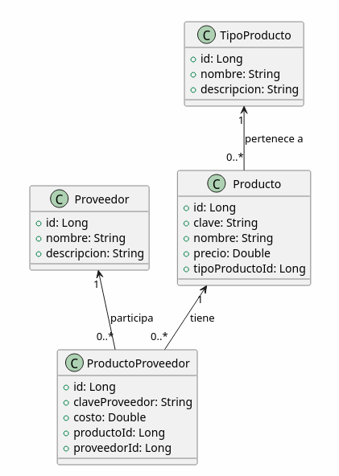
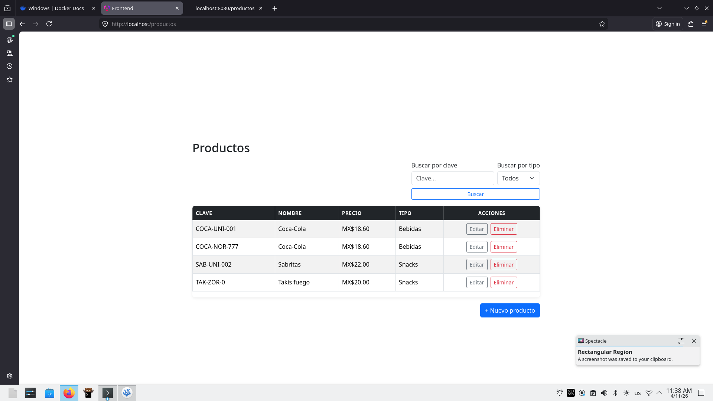
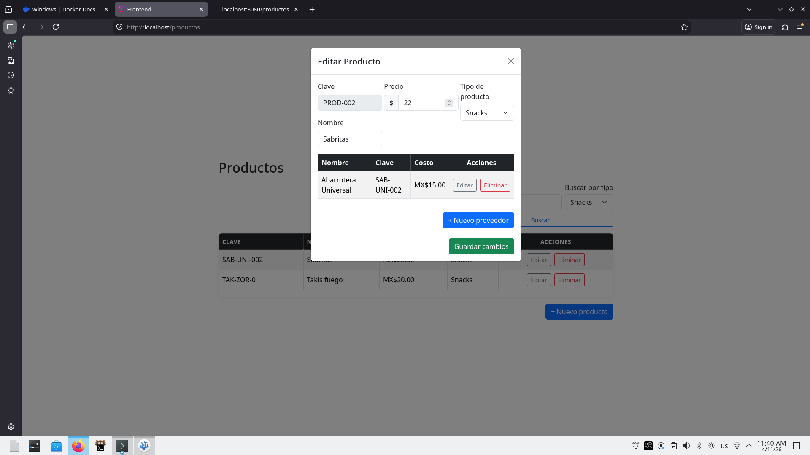
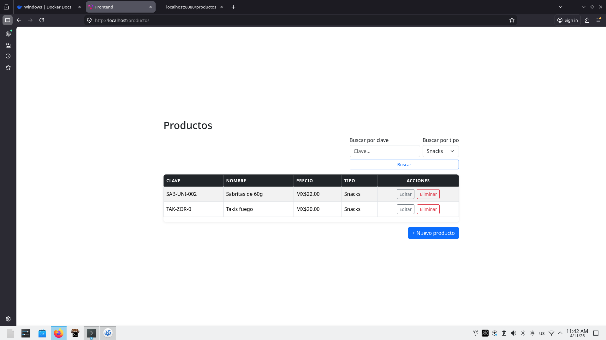
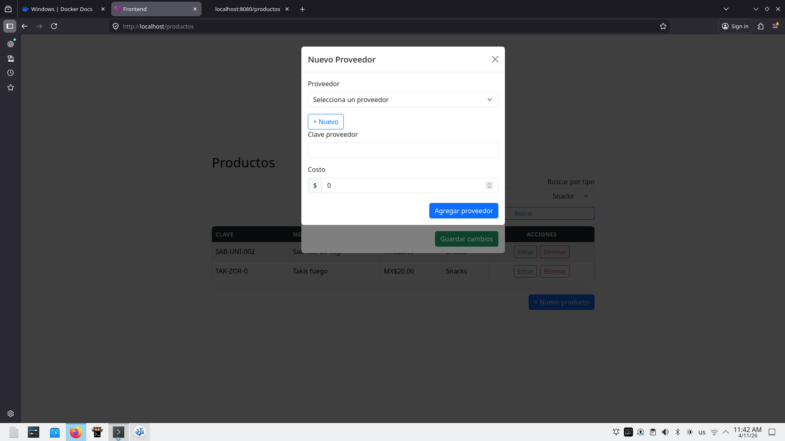
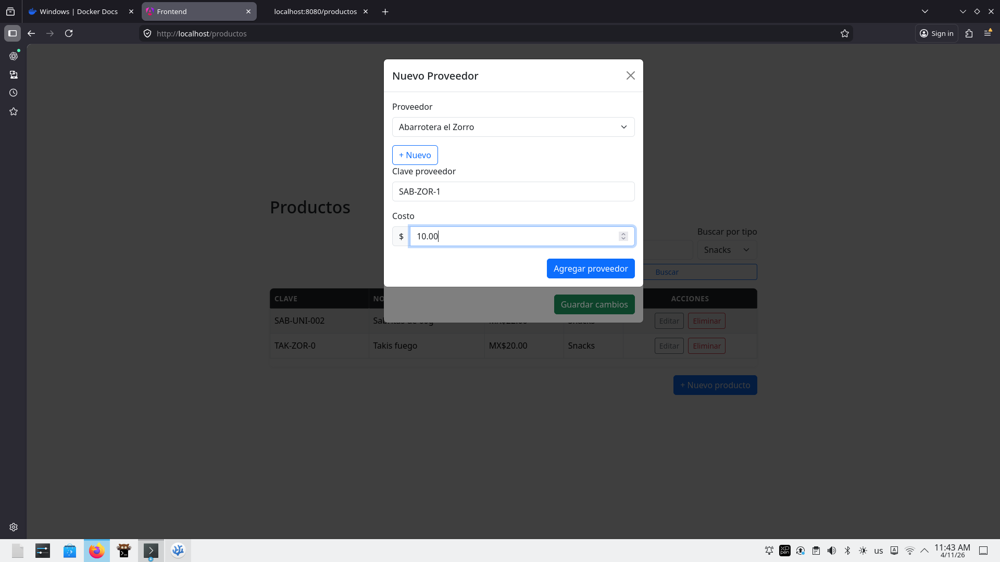
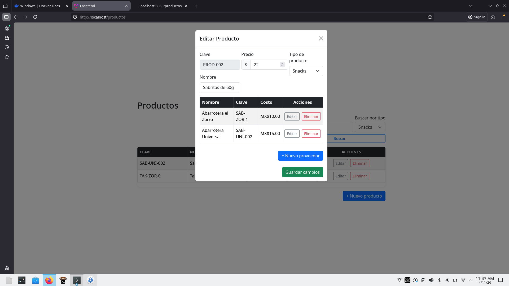
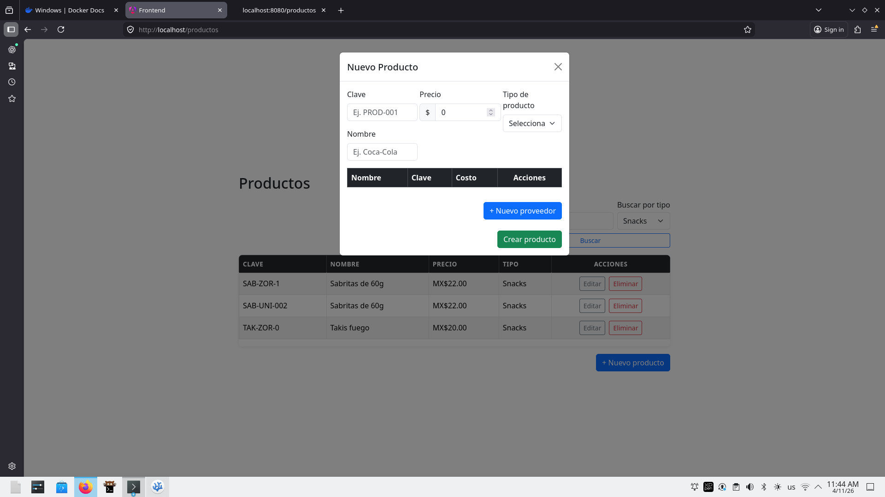

## Requisitos
- Docker Desktop instalado

Para instalar Docker, se puede ejecutar este comando desde
Powershell en Windows: 
winget install --id Docker.DockerDesktop -e --source winget
O descargarlo e instalarlo manualmente de: 
https://docs.docker.com/desktop/setup/install/windows-install/
Después, se debe ejecutar como administrador para correr el daemon.
Si aparece un aviso de que requiere virtualización, se necesita activar
desde el BIOS/UEFI, o instalar WSL con el comando: wsl --install desde PowerShell y reiniciar.

## Ejecutar
git clone https://github.com/JaimELegor/almaximoti-prueba.git
 (Si no se tiene Git, descargar directamente el .zip)
cd alm-prueba
docker-compose up --build

## URLs
- Frontend:      http://localhost
- Backend:       http://localhost:8080
- Base de datos: localhost:1433 (usuario: sa / AlmPrueba123!)

# Diagrama UML:

# Archivo de ejecución BD:
- Se compone de los archivos:
    - docker/init-db.sql
    - database/01_schema.sql
    - database/02_procedures.sql
    - database/03_seed.sql

# Manual de usuario:

## Listado:

## Editar producto:

## Editar proveedor:

## Nuevo producto:

